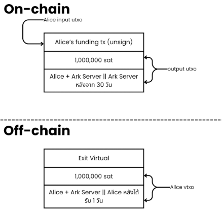

# Silent Payments: บทถัดไปของวิวัฒนาการความเป็นส่วนตัวบนบิตคอยน์

บิตคอยน์มักถูกเข้าใจผิดว่าเป็นเงินดิจิทัลที่ไม่ระบุตัวตน แต่ในความเป็นจริงแล้วนั้น เครือข่ายนี้ถูกออกแบบให้โปร่งใสอย่างถึงที่สุด เพราะทุกธุรกรรมถูกบันทึกลงบนบล็อกเชนอย่างถาวร และเปิดให้ใครก็ตามสามารถตรวจสอบได้ ทำให้เส้นทางการเงินไม่เคยเลือนหายไปจากระบบ มีเพียงก็แต่ตัวตนของผู้ใช้เท่านั้นที่อาจถูกซ่อนอยู่ชั่วคราว และเมื่อการวิเคราะห์เชนพัฒนาไปไกล ความเป็นส่วนตัวจึงค่อย ๆ กลายเป็นสิ่งที่รักษาได้ยากขึ้นทุกวัน

นั่นทำให้ในโลกที่ทุกธุรกรรมบนบิตคอยน์ถูกบันทึกอย่างโปร่งใสและไม่อาจลบเลือน ความเป็นส่วนตัวจึงไม่ใช่เพียง “ทางเลือก” หากแต่เป็นโจทย์เชิงโครงสร้างที่ท้าทายระบบโดยตรง และเมื่อมันมีความต้องการสำหรับวิธีทำธุรกรรมบนเชนที่ทั้งปลอดภัย ไม่ทิ้งร่องรอย และไม่ต้องพึ่งพาความไว้วางใจจากบุคคลที่สามเพิ่มสูงขึ้น แนวคิดใหม่อย่าง **Silent Payments** ก็ได้ก้าวขึ้นมาในฐานะคำตอบสำคัญสำหรับปัญหานี้

บทความนี้จะพาคุณสำรวจ **Silent Payments** ตั้งแต่พื้นฐานว่าแนวคิดนี้คืออะไร เหตุใดมันจึงมีความหมายต่ออนาคตของเครือข่ายบิตคอยน์ ไล่เรียงไปจนถึงหน้าตาของ address แบบ Silent Payment และกลไกสำคัญที่ทำให้มันเป็นไปได้

### Silent Payments คืออะไร?

**Silent Payments** คือกลไกการรับบิตคอยน์ที่ใช้ public key เพียงชุดเดียว แต่สามารถสร้างที่อยู่รับเงินแบบใช้ครั้งเดียว (one-time address) สำหรับแต่ละธุรกรรมได้โดยอัตโนมัติ ซึ่งส่งผลให้ข้อมูลบางอย่าง เช่นยอดคงเหลือและประวัติการรับเงินไม่สามารถถูกเปิดเผยผ่าน address ได้

แล้วทำไม public address ถึงเป็นปัญหา?

ปัญหาของ public address บนบิตคอยน์คือมันไม่ได้เป็นเพียงแค่ที่อยู่สำหรับรับเงิน แต่มันยังทำหน้าที่เป็นตัวระบุตัวตนบนบล็อกเชนในทางปฏิบัติ เพราะเมื่อใดก็ตามที่ public address ถูกเปิดเผย จะทำให้ใคร ๆ ก็ตามสามารถตรวจสอบได้ทั้งยอดคงเหลือและประวัติธุรกรรมทั้งหมดที่เชื่อมโยงกับ address นั้นได้อย่างถาวร และเมื่อ address ชุดนั้นได้ถูกผูกเข้ากับตัวตนจริง ไม่ว่าจะผ่านการใช้งานบนเว็บเทรด การบริจาค หรือกิจกรรมออนไลน์อื่น ๆ ก็จะทำให้ธุรกรรมทั้งหมดในอดีตและอนาคตอาจถูกไล่เรียงกลับไปถึงเจ้าของได้ในทันที สิ่งนี้เองที่ทำให้ความโปร่งใส ซึ่งเป็นหัวใจของบิตคอยน์กลายเป็นความเสี่ยงด้านความเป็นส่วนตัว และในบางกรณียังลุกลามไปถึงความปลอดภัยของผู้ใช้งานในโลกแห่งความเป็นจริงอีกด้วย

ด้วยข้อจำกัดเชิงโครงสร้างเช่นนี้เอง ทำให้การแก้ปัญหาความเป็นส่วนตัวบนบิตคอยน์นั้นไม่อาจพึ่งพาเพียงวินัยของผู้ใช้หรือแนวปฏิบัติชั่วคราวอย่างการหลีกเลี่ยงการใช้ address ซ้ำ ๆ ได้อีกต่อไป แต่สิ่งที่จำเป็นคือกลไกใหม่ที่เปิดให้ผู้รับสามารถเปิดเผยข้อมูลได้เท่าที่จำเป็น โดยไม่เปลี่ยน public address ให้กลายเป็นจุดศูนย์กลางของการเฝ้าติดตาม และนี่เองคือบริบทที่แนวคิดอย่าง **Silent Payments** เข้ามามีบทบาท ในฐานะวิธีการรับบิตคอยน์ที่ออกแบบมาเพื่อตัดความเชื่อมโยงระหว่างสิ่งที่ผู้ใช้เผยแพร่กับข้อมูลที่ปรากฏบนบล็อกเชนอย่างเด็ดขาด

โดยแนวคิดนี้เองก็เริ่มได้รับความสนใจอย่างจริงจังผ่านข้อเสนอที่รู้จักกันในชื่อ **BIP 352** ซึ่งเสนอถึงแนวทางการใช้ที่อยู่การรับเงินแบบใช้ซ้ำได้ (reusable addresses) บนเครือข่ายของบิตคอยน์

ลองนึกภาพว่าคุณต้องรับเงินบริจาคหรือรับชำระเงินจากหลาย ๆ แหล่งตลอดทั้งปี ทางเลือกที่คุณมีในวันนี้คือการบีบให้คุณต้องเลือกระหว่างความยุ่งยากกับการแลกความเป็นส่วนตัวออกไป คุณอาจจะสร้าง address ใหม่ซ้ำแล้วซ้ำเล่าเพื่อป้องกันการเชื่อมโยง หรือคุณอาจเลือกใช้ address เดิมแล้วเปิดเผยเส้นทางการเงินทั้งหมดของตัวเองต่อสาธารณะ สถานการณ์เช่นนี้สะท้อนให้เห็นถึงข้อจำกัดเชิงโครงสร้างของบิตคอยน์ เมื่อ address กลายเป็นจุดศูนย์กลางแห่งการเฝ้าติดตาม การป้องกันความเป็นส่วนตัวจึงไม่อาจฝากไว้กับวินัยของผู้ใช้เพียงอย่างเดียวได้ นี่จึงเป็นเหตุผลสำคัญที่แนวคิดอย่าง **Silent Payments** ถูกเสนอขึ้นมาเพื่อมอบวิธีรับบิตคอยน์ที่ทั้งสะดวกและไม่เปิดเผย ซึ่งประกอบไปด้วยกลไกที่แยกข้อมูลที่ผู้รับเผยแพร่จากข้อมูลที่ปรากฏบนบล็อกเชน ทำให้การรับเงินจำนวนมากเป็นไปได้โดยไม่ต้องแลกมาด้วยความเป็นส่วนตัวของตัวตนบนเชน

แนวคิดของ Silent Payments ได้ถูกเสนอขึ้นเป็นครั้งแรกในเดือนมีนาคม ปี 2022 และเมื่อไม่นานมานี้ ข้อเสนอในรูปแบบของ BIP ก็ได้รับการบรรจุเข้าสู่ repository อย่างเป็นทางการ ซึ่งนี่นับเป็นหมุดหมายสำคัญที่สะท้อนว่ากลไกด้านความเป็นส่วนตัวรูปแบบใหม่นี้ได้ก้าวจากแนวคิดเชิงทดลอง ไปสู่ขั้นตอนที่พร้อมสำหรับการพัฒนาและนำไปใช้งานในระบบนิเวศของบิตคอยน์อย่างจริงจัง

### เหตุใด Silent Payments จึงมีความสำคัญต่อบิตคอยน์

บิตคอยน์ address ในปัจจุบันทำหน้าที่ไม่ต่างจากหมายเลขบัญชี แต่บนระบบที่ทุกอย่างเปิดเผยต่อสาธารณะเพียงแค่ค้นหา address หนึ่งบนบล็อกเอ็กซ์พลอเรอร์ ก็เพียงพอที่จะเห็นเส้นทางการเงินทั้งหมดที่ผูกอยู่กับมัน และหากคุณใช้ address เดิมซ้ำ ๆ เงินที่คุณได้รับก็จะถูกเปิดเผยต่อสาธารณะในทันที

ตัวของ **Silent Payments** ได้เข้ามาเปลี่ยนสมดุลนี้ โดยการเปิดให้คุณสามารถเผยแพร่ public address ได้โดยไม่ต้องแลกกับการเปิดเผยรายละเอียดของธุรกรรม ซึ่งมันจะปรากฏให้เห็นเฉพาะกับผู้ส่งและผู้รับเท่านั้น โดยกลไกนี้อาศัยเทคนิคทางคริปโตกราฟีที่ทำให้ผู้รับสามารถรับเงินผ่าน address ที่มีลักษณะไม่ซ้ำกันในแต่ละธุรกรรม โดยที่มีเพียงเจ้าของเท่านั้นที่สามารถตรวจพบและเข้าถึงเงินเหล่านั้นได้

แต่อย่างไรก็ตามแนวคิดเบื้องหลัง **Silent Payments** เองก็ไม่ได้ถือว่าใหม่ทั้งหมด เนื่องจากมันต่อยอดมาจากแนวคิดของ _stealth addresses_ ที่ถูกเสนอขึ้นมาตั้งแต่ปี 2012 แต่จนถึงปัจจุบัน แนวคิดดังกล่าวยังไม่เคยถูกนำมาปรับใช้กับบิตคอยน์ได้อย่างมีประสิทธิภาพและใช้งานได้จริง

แล้ว stealth addresses มันคืออะไร ?

### Stealth Addresses และ BIP 47: ความท้าทายและข้อจำกัดในการแสวงหาความเป็นส่วนตัวบิตคอยน์

ความเป็นส่วนตัวในการทำธุรกรรมบนบิตคอยน์เป็นประเด็นหลักมาตั้งแต่การถือกำเนิดของเครือข่าย ตลอดช่วงเวลาที่ผ่านมา ได้มีข้อเสนอหลากหลายรูปแบบถูกนำเสนอขึ้นเพื่อยกระดับความเป็นส่วนตัวของผู้ใช้งาน โดยแนวคิดอย่าง _stealth addresses_ และ **BIP 47** ถือเป็นหนึ่งในแนวทางที่โดดเด่น ซึ่งถูกเสนอขึ้นในช่วงแรกโดย **Peter Todd**

ในส่วนถัดไป เราจะเจาะลึกถึงข้อจำกัดและความท้าทายของแนวทางเหล่านี้ ว่าทำไมมันยังไม่สามารถตอบโจทย์ได้อย่างสมบูรณ์ แม้ว่าจะเป็นการมุ่งยกระดับความเป็นส่วนตัวและประสิทธิภาพในการทำธุรกรรม

#### Stealth Addresses

_Stealth addresses_ คือหนึ่งในแนวคิดแรก ๆ ที่ถูกเสนอขึ้นเพื่อแก้ปัญหาความเป็นส่วนตัวในการทำธุรกรรมบนบิตคอยน์&#x20;

แก่นของแนวคิดนี้คือการใช้เทคนิคทางคริปโตกราฟีเพื่อให้ผู้รับสามารถอนุมาน address รับเงินแบบใช้ครั้งเดียว ซึ่งมีเพียงเจ้าของ private key เท่านั้นที่สามารถตรวจจับและใช้จ่ายได้

แต่ในทางปฏิบัตินั้นเป็นไปได้ยาก เพราะระบบนี้ต้องพึ่งพาการเพิ่มข้อมูลคีย์พิเศษลงบนบล็อกเชน ซึ่งมักจะอาศัยฟิลด์ **OP\_RETURN** เป็นช่องทางในการฝังคีย์ดังกล่าว จุดนี้เองที่นำไปสู่ข้อจำกัดหลายประการในภายหลัง

การพึ่งพา **OP\_RETURN** เพื่อฝังข้อมูลเพิ่มเติมลงบนบล็อกเชนนั้น ไม่ได้เป็นเพียงรายละเอียดเชิงเทคนิคเล็ก ๆ น้อย ๆ แต่มันส่งผลโดยตรงต่อทั้งประสิทธิภาพและความเป็นส่วนตัวของระบบ เนื่องจากข้อมูลที่ถูกบันทึกผ่าน OP\_RETURN สามารถถูกตรวจจับและแยกแยะได้ง่าย ทำให้ธุรกรรมประเภทนี้มีลักษณะโดดเด่นและแตกต่างจากธุรกรรมทั่วไปบนเครือข่ายเป็นอย่างมาก นอกจากนี้ การเพิ่มข้อมูลส่วนเกินลงในบล็อกเชนยังเพิ่มภาระด้านพื้นที่จัดเก็บและค่าธรรมเนียม ซึ่งสวนทางกับเป้าหมายของการทำธุรกรรมที่ควรจะทั้งเป็นส่วนตัวและมีประสิทธิภาพในระยะยาว

**สรุปได้ว่าวิธีการนี้มีข้อเสียสำคัญอยู่สองประการ**\
\- **ประการแรก การสูญเสียความไม่ระบุตัวตน** การเพิ่มข้อมูลพิเศษลงบนบล็อกเชนทำให้สามารถสังเกตได้ทันทีว่าธุรกรรมนั้นเกี่ยวข้องกับ _stealth address_ ส่งผลให้ความเป็นส่วนตัวถูกบั่นทอน เพราะผู้สังเกตการณ์สามารถระบุได้ว่าธุรกรรมกำลังใช้เทคนิคดังกล่าว\
\- **ประการที่สอง ความไม่มีประสิทธิภาพและต้นทุนที่เพิ่มขึ้น** การฝังข้อมูลเพิ่มเติมลงในบล็อกเชนทำให้ธุรกรรมมีขนาดใหญ่ขึ้น ประมวลผลได้ช้าลง และมีค่าธรรมเนียมสูงขึ้น ซึ่งขัดแย้งกับหลักการสำคัญของบิตคอยน์ที่มุ่งรักษาธุรกรรมให้มีขนาดเล็ก เข้าถึงได้ง่าย และมีประสิทธิภาพ

อีกทางเลือกหนึ่งที่ถูกเสนอขึ้นในช่วงเวลานั้นคือการนำคีย์ที่มีอยู่แล้วภายในธุรกรรมมาใช้งาน แทนการเพิ่มข้อมูลใหม่ลงบนบล็อกเชน เพื่อหลีกเลี่ยงภาระข้อมูลส่วนเกินที่ไม่จำเป็นออกไปจากเชน

แต่อย่างไรก็ตาม แนวทางดังกล่าวกลับไม่ได้รับความนิยมมากนัก ซึ่งเหตุผลหลักมาจากความซับซ้อนทางเทคนิคของกระบวนการ รวมถึงการขาดเครื่องมือที่มีประสิทธิภาพในขณะนั้น และแม้ในปัจจุบันจะมีไลบรารีอย่าง **Lipsack P** ซึ่งช่วยลดความซับซ้อนของการคำนวณเหล่านี้ได้อย่างมาก แต่แนวคิดนี้ก็ถูกพักไว้โดยปริยาย

ด้วยเหตุนี้เอง แนวคิดเรื่องการรับเงินแบบไม่เปิดเผยตัวตนในยุคนั้นจึงยังไม่สามารถก้าวข้ามอุปสรรคด้านการใช้งานจริงได้ แต่มันก็ได้เปิดเส้นทางให้มีการเสนอแนวทางใหม่ที่พยายามทำให้แนวคิดดังกล่าวสามารถนำไปใช้ได้อย่างเป็นรูปธรรมมากขึ้น — ซึ่งหนึ่งในนั้นก็คือ **BIP-47**

#### BIP-47: PayNym

แทนที่จะเพิ่มข้อมูลลงบนบล็อกเชนทุกครั้งที่มีการชำระเงิน **BIP-47** ได้เสนอแนวคิดของระบบแจ้งเตือน โดยผู้ส่งจะบันทึกข้อมูลลงบนบล็อกเชนเพียงครั้งเดียว เพื่อให้ผู้รับสามารถตรวจจับและใช้ “ความลับ” นี้เป็นพื้นฐานสำหรับการทำธุรกรรมในอนาคต

ข้อดีของ BIP-47

* **ความชัดเจนสำหรับผู้รับ:** ผู้รับสามารถระบุได้อย่างง่ายดายว่าข้อมูลใดบนบล็อกเชนเป็นของตนเอง ทำให้กระบวนการตรวจสอบและยืนยันสามารถทำได้โดยง่าย
* **ลดข้อมูลส่วนเกินบนบล็อกเชน:** เนื่องจากมีการเพิ่มข้อมูลลงบนบล็อกเชนเพียงครั้งเดียว วิธีนี้จึงช่วยประหยัดพื้นที่และทรัพยากรได้มากกว่าแนวทางของ stealth addresses

จะเห็นได้ว่า BIP-47 พยายามแก้ไขปัญหาความเป็นส่วนตัวของการรับเงินบนบิตคอยน์ด้วยแนวคิดที่ลดการเพิ่มข้อมูลซ้ำซ้อนลงบนบล็อกเชน และทำให้ผู้รับสามารถระบุและจัดการธุรกรรมที่เกี่ยวข้องกับตนเองได้อย่างเป็นระบบมากขึ้น เมื่อเทียบกับแนวคิด stealth addresses แบบดั้งเดิม ซึ่งนี่ถือเป็นก้าวสำคัญที่ทำให้แนวคิดนี้เข้าใกล้การใช้งานจริงมากขึ้น แต่อย่างไรก็ตาม แนวทางนี้ก็ต้องแลกมาด้วยข้อจำกัดอีกมากมายที่จะอธิบายต่อข้างล่างนี้

ข้อเสียของ BIP-47

* **ความซับซ้อนสำหรับผู้ส่ง:** การชำระเงินแต่ละครั้ง ผู้ส่งจำเป็นต้องส่งธุรกรรมแจ้งเตือนบนเชนก่อน ซึ่งหมายถึงธุรกรรมเพิ่มเติมหนึ่งรายการ ซึ่งกระบวนการนี้อาจยุ่งยากขึ้นได้อีกในกรณีที่มีใช้งานจำนวนมาก
* **การใช้งานบล็อกเชนที่ไม่มีประสิทธิภาพ:** การเพิ่มข้อมูลลงบนบล็อกเชนเพื่อแจ้งเตือนผู้รับอาจถูกมองว่าไม่มีประสิทธิภาพ เนื่องจากข้อมูลดังกล่าวไม่ได้เกี่ยวข้องกับการชำระเงินจริงโดยตรง
* **การเชื่อมโยงการชำระเงิน:** ใน BIP-47 หากมีการชำระเงินหลายครั้งให้กับบุคคลเดียวกัน ผู้รับอาจสังเกตได้ว่าเงินทั้งหมดมาจากแหล่งเดียวกัน ซึ่งลดระดับความเป็นส่วนตัวลง แตกต่างจาก Silent Payments ที่ผู้ส่งยังคงไม่สามารถถูกระบุตัวตนได้
* **การเปิดเผยตัวตน:** ในระหว่างธุรกรรมแจ้งเตือน รหัสการชำระเงิน (payment code) ของผู้ส่งจะถูกเปิดเผย ซึ่งอาจนำไปสู่การเปิดเผยตัวตนของผู้ส่งต่อผู้รับได้ สิ่งนี้อาจเป็นปัญหาในกรณีที่ความเป็นส่วนตัวมีความสำคัญสูง เช่น การบริจาคให้กับประเด็นที่อ่อนไหว

ด้วยข้อจำกัดเหล่านี้เอง ทำให้แม้ BIP-47 จะช่วยยกระดับความเป็นส่วนตัวในบางมิติ แต่ข้อดีเหล่านี้ก็มาพร้อมกับต้นทุนและข้อจำกัดที่ชัดเจน โดยเฉพาะในด้านความซับซ้อนของการใช้งาน ประสิทธิภาพของเครือข่าย และระดับความเป็นส่วนตัวของผู้ส่ง ซึ่งกลายเป็นอุปสรรคต่อการนำไปใช้งานในวงกว้าง

<figure><figcaption></figcaption></figure>

แม้ **BIP-47** จะเป็นก้าวสำคัญที่ทำให้แนวคิดเรื่องการรับเงินแบบไม่เปิดเผยตัวตนบนบิตคอยน์เข้าใกล้การใช้งานจริงมากขึ้น แต่ข้อจำกัดด้านความซับซ้อนอย่าง ประสิทธิภาพของการใช้บล็อกเชนที่อาจไม่ดีนัก และการไม่คงไว้ซึ่งความเป็นส่วนตัวของผู้ส่ง แสดงให้เห็นว่ายังมีช่องว่างที่แนวทางนี้ไม่สามารถเติมเต็มได้อย่างสมบูรณ์ บทเรียนจาก stealth addresses และ BIP-47 จึงชี้ให้เห็นอย่างชัดเจนว่าระบบความเป็นส่วนตัวที่ยั่งยืนจำเป็นต้องผสานทั้งความเรียบง่ายในการใช้งานและการลดร่องรอยบนเชนเข้าด้วยกัน และนั่นคือบริบทที่แนวคิดอย่าง **Silent Payments** ถูกเสนอขึ้นมา เพื่อก้าวข้ามข้อจำกัดเหล่านี้โดยตรงและยกระดับความเป็นส่วนตัวของบิตคอยน์

### **กลไกการทำงานของ Silent Payments บนบิตคอยน์**

สำหรับผู้ใช้งานแล้ว กระบวนการนี้ค่อนข้างเรียบง่าย ลองจินตนาการว่าคุณมี Bitcoin wallet ที่เชื่อมต่อกับ node ของคุณเอง จากนั้นคุณก็สร้าง SP (Silent Payment) code ขึ้นมา ซึ่งสามารถแชร์ในรูปแบบ QR code ได้ โดยโค้ดนี้คือสิ่งที่คุณมอบให้ผู้อื่นเพื่อรับการชำระเงิน ใครก็ตามที่รองรับ Silent Payments สามารถสแกน QR code หรือกรอกโค้ดนี้เพื่อทำการจ่ายเงินได้ และมันก็จบเพียงเท่านั้น ทำให้สำหรับผู้ที่รัน full node อยู่แล้ว ต้นทุนแทบจะเป็นศูนย์ เนื่องจากมีการปรับแต่งประสิทธิภาพที่ทำให้กระบวนการนี้ทำงานได้อย่างมีประสิทธิผลสูง

แต่อย่างไรก็ตาม สำหรับฝั่งผู้รับจะมีภาระเพิ่มขึ้นเล็กน้อย ผู้รับจำเป็นต้องตรวจสอบทุกธุรกรรม Taproot ใหม่บนเครือข่าย เพื่อดูว่ามีการชำระเงินมายัง silent payment address ของตนหรือไม่ ซึ่งกระบวนการนี้ต้องใช้การประมวลผลจากซอฟต์แวร์กระเป๋าเงินมากขึ้น

<figure><figcaption></figcaption></figure>

#### **Silent Payment Address หน้าตาเป็นอย่างไร?**

Silent Payment address มีโครงสร้างเดียวกับ Taproot address โดย Taproot address จะขึ้นต้นด้วย prefix “bc” ซึ่งบ่งบอกว่าเป็นที่อยู่ของ Bitcoin ตามด้วย “1” และหมายเลขเวอร์ชัน จากนั้นส่วนที่เหลือของ address จะถูกเข้ารหัสด้วยรูปแบบ bech32m และสำหรับ Silent Payments นั้นจะใช้รูปแบบการเข้ารหัสเดียวกัน แต่เปลี่ยนมาใช้ prefix เป็น “sp1” เพื่อบ่งบอกว่านี่คือ Silent Payment address โดยเฉพาะ นอกจากนี้ address ประเภทนี้ยังบรรจุ public key จำนวนสองชุด ซึ่งไม่ได้ระบุปลายทางของบิตคอยน์โดยตรง แต่ทำหน้าที่เป็นข้อมูลกำกับสำหรับการสร้าง Taproot pubkey script ที่จะใช้รับเงินในแต่ละธุรกรรมเอาไว้

ในทางปฏิบัติ กลไกนี้ได้เปิดให้ผู้ใช้สามารถสร้าง แชร์ และนำ address เดิมกลับมาใช้ซ้ำได้อย่างปลอดภัย โดยไม่กระทบต่อความเป็นส่วนตัวแต่อย่างใด นอกจากนี้ ประสบการณ์ใช้งานยังไม่แตกต่างอะไรจากการใช้ Bitcoin address เดียวซ้ำไปมา แม้จะแตกต่างกันอย่างสิ้นเชิงในโครงสร้างก็ตาม เนื่องจาก Silent Payments ได้ช่วยตัดความเสี่ยงด้านการถูกติดตามออกไป นี่จึงถือเป็นหนึ่งในจุดแข็งที่สำคัญที่สุดของแนวคิด Silent Payments

#### Wallet ใดบ้างที่รองรับ Silent Payment address?

ในปัจจุบัน wallet ที่รองรับ Silent Payment address ได้แก่ **CakeWallet** และ **BitBox** เท่านั้น เนื่องจากการรองรับ Silent Payments ยังอยู่ในช่วงการพัฒนาและยังไม่ได้ถูกนำมาใช้อย่างแพร่หลาย Cake Wallet จึงเป็นหนึ่งใน wallet กลุ่มแรก ๆ ที่นำแนวคิด Silent Payments มาปรับใช้กับบิตคอยน์ โดยในขณะนี้กระเป๋าเงินดังกล่าวเปิดให้ทดลองใช้งานในรูปแบบ **public beta** ทั้งบนระบบปฏิบัติการ Android และ iOS

### Labeling

หนึ่งในความท้าทายที่เกิดขึ้นกับแนวคิด Silent Payments ในช่วงแรก คือการระบุให้ได้ว่าใครเป็นผู้ส่งเงินเข้ามา เนื่องจากทุกการชำระเงินถูกออกแบบมาให้แยกออกจากกันอย่างเงียบเชียบ และแนวทางแก้ไขที่ถูกเสนอขึ้นมาคือการนำแนวคิดเรื่อง **labeling** เข้ามาใช้งาน

แล้ว labeling คืออะไร?

Labeling คือกลไกที่ช่วยให้ผู้รับสามารถแยกแยะผู้ส่งแต่ละรายได้ แม้จะใช้ Silent Payment address เพียงอันเดียว โดยไม่กระทบต่อความเป็นส่วนตัว และไม่เพิ่มภาระในการสแกนธุรกรรมบนเครือข่ายอย่างมีนัยสำคัญ กลไกนี้ช่วยเติมเต็มประสบการณ์ใช้งานของ Silent Payments ให้ใช้งานได้จริงในชีวิตประจำวันมากยิ่งขึ้น ทั้งในแง่ของการจัดการรายรับและการติดตามที่มาโดยที่ยังคงรักษาหลักการความเป็นส่วนตัวไว้อย่างครบถ้วน

มันคือเทคนิคที่เปิดทางให้สามารถเพิ่มข้อมูลเพิ่มเติมเข้าไปใน Silent Payment address ได้ โดยไม่ต้องแลกมากับการสูญเสียความเป็นส่วนตัวของผู้ใช้ วิธีการนี้ทำได้ผ่านการปรับค่า **spending key** เพียงเล็กน้อยในลักษณะที่เป็นแบบกำหนดแน่นอน (deterministic) ทำให้ทั้งผู้ส่งและผู้รับสามารถอ้างอิงข้อมูลเดียวกันได้อย่างสอดคล้องกัน โดยที่บุคคลภายนอกไม่สามารถสังเกตหรือเชื่อมโยงความแตกต่างนั้นได้

พูดง่าย ๆ ก็คือ **spending key** ทำหน้าที่เสมือนลายเซ็นดิจิทัลที่ใช้ยืนยันสิทธิ์ในการใช้จ่ายเงินจาก address หนึ่ง ๆ และด้วยการปรับค่า key นี้เพียงเล็กน้อย ผู้รับก็สามารถแยกแยะได้ว่าเงินที่เข้ามาแต่ละครั้งมาจากแหล่งใด โดยที่ความแตกต่างนั้นยังคงมองไม่เห็นสำหรับบุคคลภายนอกบนบล็อกเชน

ตัวอย่างเช่น ลองจินตนาการว่าคุณมี Silent Payment address อยู่สองชุด ชุดหนึ่งใช้สำหรับกิจกรรมของคุณบน X และอีกชุดหนึ่งใช้สำหรับกิจกรรมบน Nostr ด้วยกลไกของ labeling ส่วนแรกของ address ทั้งสองจะเหมือนกัน ซึ่งบ่งบอกว่าทั้งคู่เป็นของคุณคนเดียวกัน แต่ในขณะเดียวกัน ส่วนที่สองของ address จะมีความแตกต่างกันเล็กน้อย ช่วยให้คุณทราบได้ว่าเงินแต่ละก้อนถูกส่งมาจากบริบทใด

ผลลัพธ์คือ เมื่อคุณตรวจสอบยอดเงินหรือธุรกรรมย้อนหลัง คุณจะสามารถแยกออกได้ว่าเงินส่วนหนึ่งมาจากผู้ใช้งานบน X ขณะที่อีกส่วนหนึ่งมาจาก Nostr โดยทั้งหมดนี้เกิดขึ้นโดยไม่เปิดเผยข้อมูลใด ๆ เพิ่มเติมต่อสาธารณะ ความยืดหยุ่นลักษณะนี้เองที่ทำให้ Silent Payments สามารถรักษาสมดุลระหว่างความเป็นส่วนตัวบนบล็อกเชน และความสามารถในการจัดการข้อมูลธุรกรรมที่มีประโยชน์ต่อผู้ใช้ได้อย่างลงตัว

แต่อย่างไรก็ตาม หากคุณต้องการความเป็นส่วนตัวอย่างสมบูรณ์ คุณสามารถเลือกใช้ Silent Payment address แบบมาตรฐานที่ไม่ใช้ label ได้ ซึ่งจะทำให้ผู้ส่งไม่เปิดเผยข้อมูลที่สามารถระบุตัวตนหรือที่มาของการชำระเงินใด ๆ เลย ในทางกลับกัน หากการทราบแหล่งที่มาของเงินมีความสำคัญต่อคุณ กลไก labeling ก็เป็นเครื่องมือที่ช่วยเพิ่มมุมมองนี้ได้อย่างมีประสิทธิภาพ โดยไม่ทำลายหลักการความเป็นส่วนตัวที่ Silent Payments ถูกออกแบบมาเพื่อรักษาไว้

เทคโนโลยีนี้สามารถนำไปประยุกต์ใช้ได้ในหลากหลายบริบท ตั้งแต่แพลตฟอร์มแลกเปลี่ยนสินทรัพย์ดิจิทัล โซเชียลมีเดีย ไปจนถึงการใช้งานส่วนบุคคล ช่วยให้คุณสามารถบริหารจัดการตัวตนออนไลน์หลายรูปแบบได้โดยไม่ทิ้งร่องรอยการเชื่อมโยงที่ชัดเจนระหว่างกัน หรือเลือกเปิดรับข้อมูลเพิ่มเติมเกี่ยวกับที่มาของการชำระเงินเมื่อจำเป็น ทั้งหมดนี้สะท้อนให้เห็นว่า Silent Payments ไม่ได้เป็นเพียงเครื่องมือด้านความเป็นส่วนตัว แต่เป็นโครงสร้างพื้นฐานที่เพิ่มอิสระในการควบคุมข้อมูลทางการเงินของผู้ใช้บนบิตคอยน์อย่างแท้จริง

### **สรุป**

Silent Payments มีศักยภาพในการเปลี่ยนแปลงวิธีที่ผู้คนใช้งานบิตคอยน์อย่างมีนัยสำคัญ โดยมอบประสบการณ์ที่เรียบง่าย เป็นธรรมชาติ และเข้าใจง่ายยิ่งขึ้น ควบคู่ไปกับการยกระดับความเป็นส่วนตัวในระดับโครงสร้าง หากแนวคิดนี้ถูกนำไปใช้อย่างแพร่หลาย มันอาจช่วยลดการนำ address เดิมกลับมาใช้ซ้ำบนเชนได้อย่างมาก ส่งผลให้ระบบนิเวศของบิตคอยน์มีความปลอดภัยและเป็นส่วนตัวมากขึ้นสำหรับทุกคน

ที่สำคัญยิ่งไปกว่านั้น Silent Payments เปิดโอกาสให้แรงจูงใจของผู้ใช้สอดคล้องกับแนวปฏิบัติด้านความเป็นส่วนตัวที่ดีที่สุดโดยไม่ต้องเพิ่มความซับซ้อนในการใช้งาน นี่อาจเป็นก้าวสำคัญที่ทำให้อนาคตของการชำระเงินบนบิตคอยน์ “เงียบ” ลง ปลอดภัยขึ้น และเป็นมิตรกับผู้ใช้มากกว่าที่เคยเป็นมา

ref >> [https://x.com/areabitcoin/status/2012991056762085501?s=46](https://x.com/areabitcoin/status/2012991056762085501?s=46)
