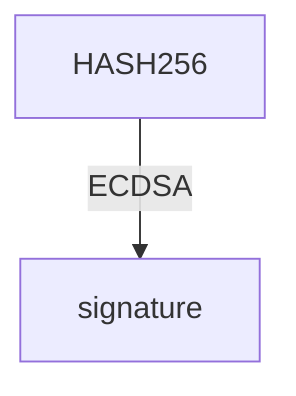

# Right Tech EP.2



## Keys

**กุญแจ (Key)** คือชุดข้อมูลที่ใช้สำหรับเข้ารหัสและถอดรหัสข้อมูล ในระบบบิตคอยน์มีการใช้กุญแจอยู่สองประเภทหลัก ได้แก่ **กุญแจสาธารณะ (Public Key)** และ **กุญแจส่วนตัว (Private Key)** ซึ่งมีบทบาทสำคัญในการทำธุรกรรมบนเครือข่ายบิตคอยน์

***

### 1. Private Key

> A very large random number

#### 1.2 What is Private Key

* **Private Key** คือ ตัวเลขที่สุ่มขึ้น และ มีขนาดใหญ่ (256-bit)
* ใช้ในการสร้าง **Public Key** และ **Signature**
* **Private Key** จะต้องเก็บเป็นความลับ และไม่ควรเปิดเผยให้ใครรู้

นี่คือตัวอย่าง Private Key

```bash
1010 1011 1101 1100 1001 1111 0010 1111 0100 0011 0111 1011 1100 1011 1011 1010 1010 1000
1111 1111 1001 0101 0000 1011 0001 0111 0001 0111 1110 1101 0100 0110 0001 1001 1110 1010
0010 0111 1000 1000 1111 0000 0100 0111 1010 1001 1110 0101 1000 1011 0100 1111 0110 0100
1110 1111 0000 1010 1100 1010 1001 1000 1000 1001
```

#### 1.1 Security

* **Private Key ปลอดภัยแค่ไหน?**\
  ความปลอดภัยของ Private Key อยู่ที่การเป็นตัวเลขที่ถูกสุ่มขึ้นมาอย่างสมบูรณ์แบบ ดังนั้นการคนอื่นรู้ Private Kay ของคุณหมายความว่า คุณเป็นคนบอกเขาเองไม่ว่าจะเป็นทางตรงหรือทางอ้อม
* **มีโอกาสสุ่มได้ Private Key เดียวกันหรือไม่?**\
  โอกาสในการสุ่มได้ Private Key ซ้ำกันมีน้อยมากจนแทบเป็นไปไม่ได้
* **ขนาดของ Private Key**\
  Private Key มีขนาด **256-bit**
* **โอกาสสุ่มซ้ำ**\
  โอกาสที่จะสุ่มได้ Private Key เดียวกันคือ $1$ ใน $2^{256}$ หรือประมาณ $1$ ใน $10^{77}$
* **เปรียบเทียบความน่าจะเป็น**\
  ตัวเลข $10^{77}$ ใกล้เคียงกับจำนวนอะตอมทั้งหมดในจักรวาล\
  หมายความว่าการสุ่มได้ Private Key ซ้ำกัน เปรียบได้กับการที่คนสองคนเลือกอะตอมเดียวกันจากทั้งจักรวาล

***

### 2. Public Key

> A point on the elliptic curve

#### 2.1 What is Public Key

* **Public Key** คือ ค่าที่ได้จากการนำ **Private Key** มาคำนวณด้วย **Elliptic Curve**
* ใช้ในการรับ Bitcoin (**Public Key** สามารถเปิดเผยให้คนอื่นได้)
* ใช้ในการ **lock Transaction output**

#### 2.2 Creating

> How to create a public key

ก่อนอื่นเราต้องเข้าใจ **Elliptic Curve** ก่อน

* **Elliptic Curve** คือ สมการทางคณิตศาสตร์ที่ใช้ในการสร้าง **Public Key**
* สมการ **Elliptic Curve** มีรูปแบบทั่วไปดังนี้:

$$
y^2 = x^3 + ax + b \mod p
$$

* โดยที่ Bitcoin ใช้ Elliptic Curve ที่ชื่อว่า **secp256k1** ซึ่งมีค่าคงที่ดังนี้:

$$
\begin{aligned}
a &= 0 \\
b &= 7 \\
p &= 2^{256} - 2^{32} - 2^9 - 2^8 - 2^7 - 2^6 - 2^4 - 1
\end{aligned}
$$

* ดังนั้นสมการของเราจะเป็น:

$$
y^2 = x^3 + 7 \mod p
$$

$$
p \equiv \text{prime field}
$$

* การสร้าง **Public Key** ทำโดยการคูณ **Private Key** กับ **Generator Point (G)**:

$$
\text{Public Key} = \text{Private Key} \times G
$$

$$
G \equiv \text{Generator Point (constant)}
$$

#### 2.3 Finnite Field

> What is Finite Field and Why use it?

* **Finite Field** คือ กลุ่มของตัวเลขที่มีขนาดจำกัด
* ในกรณีของ Bitcoin จะใช้ **Finite Field** ของจำนวน**เต็มบวกไม่มีทศนิยม** ที่มีขนาด $p$ ซึ่งเป็นจำนวนเฉพาะ
  * ซึ่งทำให้เส้นโค้งที่ต่อเนื่องแบบจำนวนจริงนั้น “แตกออก” กลายเป็นจุดๆ บนกราฟ

]

* แล้วทำไมถึงใช้ **Finite Field?**
  * เพราะเมื่อต้องทำการเข้ารหัสบนคอมพิวเตอร์ การทำงานกับ จำนวนเต็ม ใน **finite field** (เช่น 1, 2, 3, 4, ..., p) จะง่ายกว่าการทำงานกับจำนวนจริงที่ ไม่มีที่สิ้นสุด (เช่น 0.911722707844879, 2.90107701845366, ...)
  * ถ้าใช้เลขทศนิยมบนคอมพิวเตอร์ อาจเกิดความคลาดเคลื่อนหรือไม่แม่นยำได้ แต่ถ้าใช้เซตของจำนวนเต็มใน **finite field** ความแม่นยำจะสูงกว่า ซึ่งเหมาะกับการใช้ในงานเข้ารหัส

#### 2.4 Elliptic Curve Mathematics

> How to do math on elliptic curve

* ในการดำเนินการทางคณิตศาสตร์บน **Elliptic Curve** จะมีการเดินการ 2 แบบคือ
  1. **add**: การบวกจุดสองจุดเข้าด้วยกัน
  2. **double**: การ “ดับเบิ้ล” จุด (การเพิ่มจุดนั้นเข้ากับตัวมันเอง)\
     <br>
* สองฟังก์ชันนี้รวมกันเพื่อทำ **multiply()** หรือการคูณจุดบนเส้นโค้งได้

#### 2.5 Formath

> What does a public key look like?

* **Public Key** จะมี 2 รูปแบบคือ
  * **Uncompressed Public Key**
  *   **Compressed Public Key**

      

      * ถ้า prefix เป็น 02 คือเลขคู่
      * ถ้า prefix เป็น 03 คือเลขคี่

#### 2.6 Location

* **Public keys** สามารถพบได้ใน `ScriptPubKey`, `ScriptSig`, หรือ `Witness` ของ raw transactions ขึ้นอยู่กับประเภทของ Script:
  * **P2PKH** (Pay to Public Key Hash)
    * Public Key อยู่ใน **input** → `ScriptSig`
    * Public Key Hash อยู่ใน **output** → `ScriptPubKey`\
      <br>
  * **P2MS** (Pay to MultiSig)
    * Public Keys หลายตัวจะอยู่ใน **output** → `ScriptPubKey`\
      <br>
  * **P2WPKH** (Pay to Witness Public Key Hash)
    * Public Key อยู่ใน **input** → `Witness`
    * Public Key Hash อยู่ใน **output** → `ScriptPubKey` (เป็น witness program)

***

### 3. Public Key Hash

> A shortened public key

* **Public Key Hash** คือผลลัพธ์ของการ hash ค่า **Public Key**
* **Public Key Hash** ถูกใช้ในสคริปต์ล็อกยอดนิยม เช่น:
  * **P2PKH** (Pay To Public Key Hash)
  * **P2WPKH** (Pay To Witness Public Key Hash)

#### 3.1 Creating

* **Public Key Hash** ถูกสร้างโดยการนำ **Public Key** มา hash ด้วย:
  * **SHA256** ตามด้วย **RIPEMD160** (เรียกรวมว่า **Hash160**)
  * ผลลัพธ์คือ Hash ขนาด **160-bit** หรือ **20 bytes**\
    <br>
* นี้คือการเปรียบเทียบขนาดของ **Uncompressed Public Key**, **Compressed Public Key** และ **Public Key Hash**

[](https://static.learnmeabitcoin.com/diagrams/png/keys-public-key-hash-size.png)

#### 3.2 Usage

* เหตุผลหลักในการ **public key hash** คือเพื่อให้สามารถ ย่อขนาดลงก่อนแปลงเป็น **addres**
* เมื่อมีคนส่งบิตคอยน์มายัง address ของเรา พวกเขาได้ทำการล็อก **output** กับ **public key hash** ของเราไม่ใช่กับ **public key** ทั้งหมดของเราโดยตรง
* เมื่อเราจะใช้จ่ายบิตคอยน์เหล่านี้ในธุรกรรมถัดไป เราจะต้องใส่ **public key** ต้นฉบับ พร้อมกับ **ลายเซ็น (signature)** ในสคริปต์ปลดล็อกของ **input**

#### 3.3 Location

* **P2PKH (Pay to Public Key Hash)**:
  * **ScriptPubKey** → เก็บ **Public Key Hash** ของ **P2PKH**
  * **Public Key** จะถูกเปิดเผยใน **ScriptSig** เมื่อ **ouptput** นี้ ถูกใช้ใน **input** ใน **spending transaction**\
    <br>
* **P2WPKH (Pay To Witness Public Key Hash)**:
  * **Public Key Hash** จะอยู่ใน **ScriptPubKey** ของ P2WPKH
  * **Public Key** จะถูกเปิดเผยใน **Witness** เมื่อ **ouptput** นี้ ถูกใช้ใน **input** ใน **spending transaction**\
    <br>

***

### 4. Address

> An easy-to-share format of a locking script

* **Address** คือรูปแบบที่ใช้แทน **locking script** ประเภทหนึ่ง ซึ่งเป็นวิธีการกำหนดเงื่อนไขในการ **"ล็อก"** Bitcoin
* **Address** จะเป็นการ **encode(เข้ารหัส)** ห้เข้าใจง่ายและใช้งานสะดวก โดยภายในจะเก็บข้อมูลของ **Public Key Hash** หรือ **Script Hash**
* เมื่อคุณส่ง **address** ให้ผู้อื่น นั่นหมายถึง คุณกำลังบอกให้เขาส่ง Bitcoin มาให้คุณโดยผูกไว้กับ รูปแบบสคริปต์เฉพาะ ซึ่งอ้างอิงจาก hash ที่อยู่ใน **address** นั้น

#### 4.1 Usage

* ในระบบ Bitcoin เราใช้ **address** เมื่อต้องการส่ง Bitcoin ให้ใครบางคนผ่าน **Bitcoin Wallet**
* ตัว Wallet จะถอดรหัส address เพื่อดูว่าเป็นรูปแบบของ **locking script** ประเภทใด
* จากนั้นจะดึงค่า **Public Key Hash** หรือ **script hash** ออกมา
* แล้วนำค่าเหล่านี้ไปใส่ไว้ใน **ScriptPubKey** ของ **output** ในธุรกรรม
* ตัวอย่าง:
  * **Address** ที่ขึ้นต้นด้วย เลข 1 (เช่น 1...) หมายถึงเป็น address แบบ **P2PKH** ซึ่งภายในเก็บ **Public Key Hash** และจะถูกแปลงเป็น **locking script** ตามรูปแบบของ **P2PKH**
  * note: **Address** จะ**ไม่ถูกบันทึก**ลงโดยตรงในข้อมูลดิบของ Blockchain

#### 4.2 Type

| Address Type | Encoding | Prefix | ตัวอย่าง      | Contains           |
| ------------ | -------- | ------ | ------------- | ------------------ |
| P2PKH        | Base58   | 1      | **1**A1z...   | Public Key Hash    |
| P2SH         | Base58   | 3      | **3**J98...   | Script Hash        |
| P2WPKH       | Bech32   | bc1q   | **bc1q**...   | Public Key Hash    |
| P2WSH        | Bech32   | bc1q   | **bc1q**ru5.. | Script Hash        |
| P2TR         | Bech32m  | bc1p   | **bc1p**...   | Tweaked Public Key |

***

### 5. Signature (ลายเซ็น)

> Proof that you own a public key

* **signature** ถูกใช้เพื่อ พิสูจน์ว่าคุณคือเจ้าของ public key
* **signature** จะถุกสร้างจาก **Private Key** เดียวกับที่ใช้สร้าง **Public Key** นั้น
* ซึ่งหมายความว่า **signature** จะมีความเชื่อมโยงทางคณิตศาสตร์แบบเฉพาะกับ **Public Key** ซึ่งเพียงพอสำหรับการพิสูจน์ว่าคุณเป็น “เจ้าของ **Public Key** นั้น โดยไม่จำเป็นต้องเปิดเผย **Privat Key**

#### 5.1 Creating

* การสร้าง **Signature** คุณต้องมี
  * **message**: ข้อมูลธุรกรรม (transaction data)
  * **Private Key**\
    <br>
* ขั้นตอนพื้นการ **sign transaction** (การเซ็นธุรกรรม)
  * สร้าง ธุรกรรม **(transaction)** — นี่คือข้อความ (message) ที่เราจะเซ็น
  * ใช้ **Private Key** ของคุณในการเซ็นธุรกรรม
  * นำ **ลายเซ็น** ที่ได้กลับมาใส่ในธุรกรรม

#### 5.2 Legacy Algorithm

* ขั้นตอนการเซ็นแบบ **Legacy (ตัวอย่าง P2PKH)**

**0. สร้างข้อมูลธุรกรรม (Raw Transaction)**

* ระบุ `TXID`, `VOUT` ที่จะใช้เป็น **input**
* สร้าง **output** ใหม่พร้อมจำนวน Bitcoin ที่ต้องการส่ง
* ยังไม่ใส่ **ScriptSig** (ลายเซ็นยังไม่ถูกเพิ่ม)

```json
Raw Transaction (Unsigned):

version: 01000000
inputs:  01
  txid: b7994a0db2f373a29227e1d90da883c6ce1cb0dd2d6812e4558041ebbbcfa54b
  vout: 00000000
  scriptsigsize: 00
  scriptsig:<-- empty -->
  sequence: ffffffff
outputs: 01
  amount: 983a000000000000
  scriptpubkeysize: 19
  scriptpubkey: 76a914b3e2819b6262e0b1f19fc7229d75677f347c91ac88ac
locktime: 00000000

```

**1. ลบ ScriptSig เดิม (ถ้ามี)**

* ลบ **ScriptSig** เพื่อเตรียมใส่ลายเซ็นใหม่
* หากมีข้อมูล **SegWit** ให้ลบ marker, flag และ witness ด้วย

**2. ใส่ ScriptPubKey จาก output เดิมลงใน ScriptSig (ชั่วคราว)**

```json
version: 01000000
inputs:  01
  txid: b7994a0db2f373a29227e1d90da883c6ce1cb0dd2d6812e4558041ebbbcfa54b
  vout: 00000000
  scriptsigsize: 00
  scriptsig:76a914b3e2819b6262e0b1f19fc7229d75677f347c91ac88ac <-- same scriptpubkey
  sequence: ffffffff
outputs: 01
  amount: 983a000000000000
  scriptpubkeysize: 19
  scriptpubkey: 76a914b3e2819b6262e0b1f19fc7229d75677f347c91ac88ac
locktime: 00000000

```

**3. เพิ่ม Signature Hash Type (SIGHASH\_ALL)**

* ใช้ `0x01` เพื่อระบุว่าลายเซ็นจะครอบคลุมทุก **input/output**

```json
version: 01000000
inputs:  01
  txid: b7994a0db2f373a29227e1d90da883c6ce1cb0dd2d6812e4558041ebbbcfa54b
  vout: 00000000
  scriptsigsize: 00
  scriptsig:76a914b3e2819b6262e0b1f19fc7229d75677f347c91ac88ac <-- same scriptpubkey
  sequence: ffffffff
outputs: 01
  amount: 983a000000000000
  scriptpubkeysize: 19
  scriptpubkey: 76a914b3e2819b6262e0b1f19fc7229d75677f347c91ac88ac
locktime: 00000000
sighash: 01000000 <--  add SIGHASH_ALL

```

**4. ทำ Double SHA-256 กับ ข้อมูลธุรกรรม**

* ใช้ `HASH256(message)` = `SHA256(SHA256(message))` หรือ **double SHA-256**
* สร้าง **message hash** สำหรับนำไปเซ็น

```json

message = 0100000001b7994a0db2f373a29227e1d90da883c6ce1cb0dd2d6812e4558041ebbbcfa54b000000000076a914b3e2819b6262e0b1f19fc7229d75677f347c91ac88acffffffff01983a0000000000001976a914b3e2819b6262e0b1f19fc7229d75677f347c91ac88ac0000000001000000
HASH256(message) = a6b4103f527dfe43dfbadf530c247bac8a98b7463c7c6ad38eed97021d18ffcb

```

**5. sign transaction ด้วย Private Key (ผ่าน ECDSA)**

* สร้างลายเซ็น $(r, s)$ จาก **Private Key** และ **nonce**



**6. ใช้ค่า s แบบ “low”**

* หากได้ค่า `s` สูง ให้แปลงเป็น `n - s`
* เพื่อป้องกัน **transaction malleability** (BIP 62)

```json
n = 115792089237316195423570985008687907852837564279074904382605163141518161494337

high s value:
s = 101656099268479774907861155236876278987061611115278341531512875302287938750185

low s value:
n - s = 14135989968836420515709829771811628865775953163796562851092287839230222744152

```

**7. เข้ารหัสลายเซ็นด้วย DER (Distinguished Encoding Rules)**

* แปลงลายเซ็น `(r,s)` เป็นรูปแบบ DER
* DER signature จะมีรูปแบบดังนี้

```json
der encoded signature:
type: 30
  length: 44
  type:   02
    length: 20
    r:      08f4f37e2d8f74e18c1b8fde2374d5f28402fb8ab7fd1cc5b786aa40851a70cb
  type:   02
    length: 20
    s:      1f40afd1627798ee8529095ca4b205498032315240ac322c9d8ff0f205a93a58

serialized: 3044022008f4f37e2d8f74e18c1b8fde2374d5f28402fb8ab7fd1cc5b786aa40
            851a70cb02201f40afd1627798ee8529095ca4b205498032315240ac322c9d8f
            f0f205a93a58

```

**8. เพิ่ม SIGHASH (0x01) ลงท้าย DER signature**

* เพิ่ม `0x01` ที่ท้ายลายเซ็น DER

```json
der encoded signature:
type: 30
  length: 44
  type:   02
    length: 20
    r:      08f4f37e2d8f74e18c1b8fde2374d5f28402fb8ab7fd1cc5b786aa40851a70cb
  type:   02
    length: 20
    s:      1f40afd1627798ee8529095ca4b205498032315240ac322c9d8ff0f205a93a58

sighash: 01 <-- add this

serialized: 3044022008f4f37e2d8f74e18c1b8fde2374d5f28402fb8ab7fd1cc5b786aa40
            851a70cb02201f40afd1627798ee8529095ca4b205498032315240ac322c9d8f
            f0f205a93a58`01` <-- add 01


```

**9. สร้าง ScriptSig (unlocking script)**

* นำลายเซ็นที่เราสร้างไว้ ไปใส่ลงใน ScriptSig ซึ่งเป็นสคริปต์ปลดล็อกสำหรับอินพุต
* **ScriptSig** จะมีรูปแบบดังนี้

```json
scriptpubkey:

asm: OP_DUP OP_HASH OP_PUSHBYTES_20 [public key hash] OP_EQUALVERIFY OP_CHECKSIG
hex: 76a9144299ff317fcd12ef19047df66d72454691797bfc88ac
```

**10. ใส่ ScriptSig ลงในธุรกรรม**

* อัปเดต `scriptsigsize` ให้ถูกต้อง

```json
Raw Transaction (Signed):

version: 01000000
inputs:  01
  txid: b7994a0db2f373a29227e1d90da883c6ce1cb0dd2d6812e4558041ebbbcfa54b
  vout: 00000000
  scriptsigsize: 6a
  scriptsig: 473044022008f4f37e2d8f74e18c1b8fde2374d5f28402fb8ab7fd1cc5b786aa40851a70cb02201f40afd1627798ee8529095ca4b205498032315240ac322c9d8ff0f205a93a580121024aeaf55040fa16de37303d13ca1dde85f4ca9baa36e2963a27a1c0c1165fe2b1
  sequence: ffffffff
outputs: 01
  amount: 983a000000000000
  scriptpubkeysize: 19
  scriptpubkey: 76a914b3e2819b6262e0b1f19fc7229d75677f347c91ac88ac
locktime: 00000000
```

note: ต้องทำขั้นตอนทั้งหมดซ้ำสำหรับ **ทุก input** ที่ต้องการปลดล็อก

***
