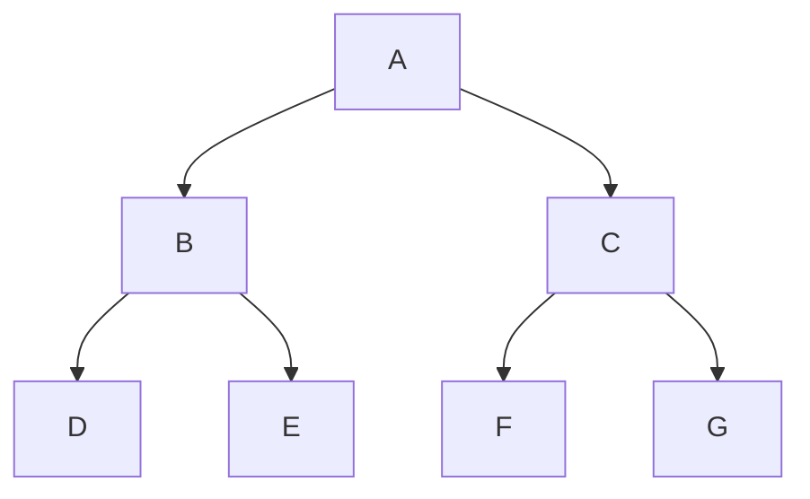

# Right Tech EP.3



## HD Wallet (Hierarchical Deterministic Wallet)

#### **Hierarchical Deterministic Wallet (HD Wallet)**

* **Hierarchical**: keys และ addresses ถูกจัดระเบียบในโครงสร้างต้นไม้ (tree structure)



<br>

โครงสร้างแบบต้นไม้

* **Deterministic**: keys และ addresses ถูกสร้างด้วยวิธีแบบเดียวกัน

#### **ประโยชน์ของ HD Wallet**

**1. single backup (สำรองข้อมูลเพียงครั้งเดียว)**

* Basic Wallet:
  * ต้องสร้างคู่คีย์ใหม่ทุกครั้งที่รับบิตคอยน์
  * ต้องสำรองข้อมูลทุกครั้งที่ได้รับการชำระเงินใหม่

[](https://static.learnmeabitcoin.com/technical/keys/hd-wallets/basic-wallet.gif)

Figure 1: Basic Wallet | Source: [learnmeabitcoin.com](https://learnmeabitcoin.com/technical/keys/hd-wallets)

* HD Wallet:
  * ใช้ seed เดียวในการสร้าง master private key
  * จาก master key นี้ สามารถสร้างคีย์ "ลูก" ได้หลายพันล้านชุด
  * เพียง backup seed ก็สามารถกู้คืนกระเป๋าเงินทั้งหมดได้
  * การสร้างคีย์เป็นแบบกำหนดแน่นอน (deterministic)

[](https://static.learnmeabitcoin.com/technical/keys/hd-wallets/hd-wallet.gif)

Figure 2: HD Wallet | Source: [learnmeabitcoin.com](https://learnmeabitcoin.com/technical/keys/hd-wallets)

**2. การจัดระเบียบ (Organization)**

* จุดเด่นของ HD Wallet คือสามารถสร้างลำดับชั้นของคีย์ (hierarchy)
* แต่ละคีย์ลูก (child key) สามารถสร้างคีย์ของตัวเองได้อีก
* ทำให้สามารถจัดโครงสร้างแบบต้นไม้เพื่อจัดระเบียบคีย์ต่าง ๆ ได้
* สามารถแบ่งคีย์ออกเป็นส่วน ๆ เพื่อใช้งานใน "บัญชี" ที่แตกต่างกัน

[](https://static.learnmeabitcoin.com/technical/keys/hd-wallets/hierarchical.gif)

Figure 3: Hierarchical structure of keys in an HD wallet | Source: [learnmeabitcoin.com](https://learnmeabitcoin.com/technical/keys/hd-wallets)

***

### 1. How do HD Wallets work?

1. **Seed Generation**:

```

seed: a6c9f42ffc41d35fac2089a2bea1be11f164475f8af86fed14cb71a400489bf5923c3f65f3561f2c3a4990023e4d9af1d61dbb4e47aa8cce3acadd35671d9327

```

* HD Wallet เริ่มต้นจากการสุ่มค่า 64 ไบต์ ซึ่งเรียกว่า **seed**
* Seed นี้จะถูกใช้เพื่อสร้าง master key

2. **Master Private Key**

* จาก seed จะถูกนำไปผ่านฟังก์ชัน HMAC-SHA512 เพื่อให้ได้ข้อมูลชุดใหม่อีก 64 ไบต์ (**master private key**)
* เราใช้ข้อมูล 64 ไบต์นี้เพื่อสร้าง **master extended private key**:
  * **Private Key**: 32 ไบต์แรก
  * **Chain Code**: 32 ไบต์สุดท้าย
* **Chain code** เป็นข้อมูลขนาด 32 ไบต์ที่จับคู่กับ **private key** เพื่อสร้างสิ่งที่เรียกว่า **extended key**


Figure 4: Master Private Key Creation | Source: [learnmeabitcoin.com](https://learnmeabitcoin.com/technical/keys/hd-wallets)

```
seed: a6c9f42ffc41d35fac2089a2bea1be11f164475f8af86fed14cb71a400489b
      f5923c3f65f3561f2c3a4990023e4d9af1d61dbb4e47aa8cce3acadd35671d9327
```

* หลังจากการแฮช seed ขนาด 64 ไบต์ด้วย **HMAC-SHA512** จะได้ข้อมูล 64 ไบต์ใหม่:

```
Master Extended Private Key:
private key: 43c324aea167036f4801bc61cc692a2e07fedf5bf9f831d8b2632a099c17d179
chain code:  4edf5041b55d2493240f08c7a8d8ca7f52fe58b22aee80682c017ef614ae058d
```

* คำนวณ master extended public key (จาก eiliptical curve):

```
public key: 033a2eca3082262b4a80cbab30bcd551ca29f582a4102363575e900f7f865a6766
```

3. **Child Keys (Basic)**

* child keys ถูกสร้างจาก **master extended private key** (private key + chain code) และเลข **index**

[](https://static.learnmeabitcoin.com/technical/keys/hd-wallets/child-keys-basic-private.gif)

Figure 5: Child Keys Creation (Basic) | Source: [learnmeabitcoin.com](https://learnmeabitcoin.com/technical/keys/hd-wallets)

```

seed: a6c9f42ffc41d35fac2089a2bea1be11f164475f8af86fed14cb71a400489b
      f5923c3f65f3561f2c3a4990023e4d9af1d61dbb4e47aa8cce3acadd35671d9327

master extended private key:
private key: 43c324aea167036f4801bc61cc692a2e07fedf5bf9f831d8b2632a099c17d179
chain code: 4edf5041b55d2493240f08c7a8d8ca7f52fe58b22aee80682c017ef614ae058d

child 0:
private key: c13f6ae889de93a90a4bb5eb5cabc69c347957019d0134cb3331ecea74d39b0f
public key: 03a057232c7467a5ce5c2cf6ffcb923551ff5d4d35b129f62db6ccb2c791aaf77d

child 1:
private key: 783f40e0544e277c633e5a3f3af880cade35022cd641fb797d41a4daa572fc3a
public key: 0253384fe8d07865e81f4bd8789e99d85cb00e3b58f6fc0fe8abf047d3f727e741

child 2:
private key: a6c40398c7ffc1f885f38961bae47ef33c7cc2c2d6005ba0cd647e7eedc85547
public key: 031cbbaa1f438be46c433666cdee423b13bbbff74dc3448e77819639166bc9f0fd

```

4. **Child Keys (Advanced)**

* ถ้าเราต้องการ **extended private key** ที่สามารถสร้าง private key และ public key ได้ แต่ต้องการให้ **extended public key** สามารถสร้าง public key ที่เหมือนกันได้หรือก็คือ เราสามารถสร้าง public key โดยไม่ต้องใช้ private key

1. **Extended Public Key**

* เริ่มจากสร้าง **extended public key**
  * นำ public key จาก extended private key มาจับคู่กับ chain code
  * public key จะถูกสร้างจาก private key (key จาก extended private key) โดยใช้ elliptic curve multiplication

```

seed: a6c9f42ffc41d35fac2089a2bea1be11f164475f8af86fed14cb71a400489bf5923c3f65f3561f2c3a4990023e4d9af1d61dbb4e47aa8cce3acadd35671d9327

master extended private key:
private key: 43c324aea167036f4801bc61cc692a2e07fedf5bf9f831d8b2632a099c17d179 --> Elliptical Curve --> public key(same)
chain code: 4edf5041b55d2493240f08c7a8d8ca7f52fe58b22aee80682c017ef614ae058d

master extended public key:
public key: 033a2eca3082262b4a80cbab30bcd551ca29f582a4102363575e900f7f865a6766 --> same
chain code: 4edf5041b55d2493240f08c7a8d8ca7f52fe58b22aee80682c017ef614ae058d

```

2. **Extended Private Key Children**

* นำ chain code มาจับคู่กับ extended public key + index มาผ่าน HMAC-SHA512

```

chain code: 4edf5041b55d2493240f08c7a8d8ca7f52fe58b22aee80682c017ef614ae058d
index: 00000000 (จะได้ child 0)
extended public: 033a2eca3082262b4a80cbab30bcd551ca29f582a4102363575e900f7f865a6766
extended public + index: 033a2eca3082262b4a80cbab30bcd551ca29f582a4102363575e900f7f865a676600000000

```

* ผลลัพธ์จาก HMAC-SHA512:

```

child 0: <-- และเปลี่ยนเลข index ไปเรื่อย ๆ
private key: 09365b121c58035aa15057ed358bcceef37b108644f646e65d9f9c5326de0b7c
public key: 03c3cf107b06d72e18802eb811259f6aa3a3e12f6ef0b4a94d9e5f835278a5a23c

```

3. **Extended Public Key Children**

* นำ chain code มาจับคู่กับ extended public key + index มาผ่าน HMAC-SHA512
* นำผลลัพธ์ 32 byte แรก จาก HMAC-SHA512 มาผ่าน Elliptical Curve Multiplication จะได้ child public key

```

master extended public key:
public key: 033a2eca3082262b4a80cbab30bcd551ca29f582a4102363575e900f7f865a6766
chain code: 4edf5041b55d2493240f08c7a8d8ca7f52fe58b22aee80682c017ef614ae058d

child 0:
public key: 03c3cf107b06d72e18802eb811259f6aa3a3e12f6ef0b4a94d9e5f835278a5a23c

child 1:
public key: 034b506d61b8cadb8c4ca3813e90d07c2144710b2b8444c7e903cf1ebbd948cf78

```

***

### 2. Extended Keys

[](https://static.learnmeabitcoin.com/diagrams/png/hd-wallets-extended-keys-serialization.png)

Figure 6: Extended Keys Serialization | Source: [learnmeabitcoin.com](https://learnmeabitcoin.com/technical/keys/hd-wallets)

* Extended Key สามารถแปลงเป็น Address เพื่อให้ง่ายต่อการนำไปใช้งานหรือส่งต่อ
* Address แบบ Extended Key จะประกอบด้วย private key/public key and chain code, พร้อมกับ ข้อมูลเมตา (Metadata) อื่น ๆ เพิ่มเติม
* ก่อนจะแปลงเป็นที่อยู่ คีย์แบบขยายจะถูก **ทำให้อยู่ในรูปแบบซีเรียลไลซ์ (Serialized)** ตามโครงสร้างฟิลด์ดังนี้:

| ฟิลด์                  | ขนาด (ไบต์) | คำอธิบาย                                                                   |
| ---------------------- | ----------- | -------------------------------------------------------------------------- |
| **Version**            | 4           | ค่าที่แสดงชนิดของ key เช่น `"xprv"` มีค่าเป็น `0488ade4`                   |
| **Depth**              | 1           | ความลึกของการแยกคีย์จาก Master Key                                         |
| **Parent Fingerprint** | 4           | 4 ไบต์แรกของ HASH160 จาก parent public key                                 |
| **Child Number**       | 4           | ลำดับ index ของ child key จาก Master Key                                   |
| **Chain Code**         | 32          | รหัสลับพิเศษ 32 ไบต์ ที่ช่วยป้องกันไม่ให้ผู้อื่นสามารถสร้าง child keys ได้ |
| **Key**                | 33          | private key (เติม `00` ข้างหน้า) หรือ public key                           |

***

### 3. Mnemonic Seed (BIP 39)

* การแทนค่าตัวเลขขนาดใหญ่ที่สุ่มขึ้นมา ด้วยลำดับของคำศัพท์ ซึ่งทำให้มนุษย์สามารถจดจำและเก็บรักษาได้ง่ายขึ้น
* คำเหล่านี้จะถูกนำมาใช้สร้างในการสร้าง seed ซึ่งจะถูกนำไปใช้ในการสร้าง extended keys ภายใน HD Wallet ได้

มี 3 ขั้นตอนในการสร้าง mnemonic sentence seed:

1. สร้างค่าเอนโทรปี (Generate Entropy)
2. แปลงเอนโทรปีเป็นคำช่วยจำ (Entropy to Mnemonic)
3. แปลงคำช่วยจำเป็นซีด (Mnemonic to Seed)

### Creating Mnemonic Seed

#### 1. **การสร้างค่าเอนโทรปี (Generate Entropy)**

[](https://static.learnmeabitcoin.com/technical/keys/hd-wallets/mnemonic-seed/entropy.gif)

Figure 7: Generating Entropy | Source: [learnmeabitcoin.com](https://learnmeabitcoin.com/technical/keys/hd-wallets/mnemonic-seed)

* สามารถจินตนาการได้ว่าเอนโทรปีคือชุดของตัวเลขสุ่มขนาดใหญ่มาก ที่ไม่สามารถสร้างซ้ำได้อีกในอนาคต
* โดยปกติแล้ว ค่าดังกล่าวจะแสดงในรูปของบิต เช่น 10011010010001...
* เอนโทรปีที่สร้างขึ้นควรมีขนาดเป็นจำนวนเท่าของ 32 บิต เพื่อให้ง่ายต่อการแบ่งเป็นกลุ่มในขั้นตอนถัดไป

#### 2. **จากเอนโทรปีสู่เมนโมนิก Entropy to Mnemonic**

เมื่อเราได้ค่าเอนโทรปีแล้ว ขั้นตอนต่อไปคือการแปลงให้เป็นประโยคที่มนุษย์สามารถจดจำได้ง่ายขึ้น

**การตรวจสอบความถูกต้อง (Checksum)**

[](https://static.learnmeabitcoin.com/diagrams/png/hd-wallets-mnemonic-seed-checksum.png)

Figure 8: Checksum Creation | Source: [learnmeabitcoin.com](https://learnmeabitcoin.com/technical/keys/hd-wallets/mnemonic-seed)

* เริ่มจากการเพิ่มข้อมูล **checksum** เข้าไปในค่าเอนโทรปี เพื่อช่วยตรวจจับข้อผิดพลาดและทำให้ใช้งานได้ง่ายขึ้น
* checksum ถูกสร้างขึ้นโดยการแฮชค่าเอนโทรปีด้วย **SHA-256** ซึ่งจะได้ผลลัพธ์เป็น “ลายนิ้วมือ” เฉพาะตัวของเอนโทรปี
* จากนั้นให้นำบิตเริ่มต้นจากค่าที่ได้จาก SHA-256 มาใช้เป็นเช็กซัม โดยใช้ **1 บิตต่อเอนโทรปี 32 บิต** แล้วนำบิตเช็กซัมไปต่อท้ายเอนโทรปีเดิม

**การแปลงเป็นคำ (Words)**

[](https://static.learnmeabitcoin.com/diagrams/png/hd-wallets-mnemonic-seed-entropy-to-mnemonic.png)

Figure 9: Entropy to Mnemonic | Source: [learnmeabitcoin.com](https://learnmeabitcoin.com/technical/keys/hd-wallets/mnemonic-seed)

* จากนั้นให้นำ **เอนโทรปี + เช็กซัม** มาแบ่งออกเป็นกลุ่มละ **11 บิต**
* แต่ละกลุ่ม 11 บิตจะถูกแปลงเป็นเลขฐานสิบ แล้วใช้ค่านั้นเป็นดัชนีเพื่อเลือกคำจาก **รายการคำ (wordlist)**
* ผลลัพธ์ที่ได้คือ **ประโยคช่วยจำ (mnemonic sentence)** ซึ่งประกอบด้วยคำที่เลือกมาเรียงกันตามลำดับ

#### 3. **จากเมนโมนิกสู่ซีด Mnemonic to Seed**

[](https://static.learnmeabitcoin.com/technical/keys/hd-wallets/mnemonic-seed/mnemonic-to-seed.gif)

Figure 10: Mnemonic to Seed | Source: [learnmeabitcoin.com](https://learnmeabitcoin.com/technical/keys/hd-wallets/mnemonic-seed)

เมื่อเราได้ **ประโยคช่วยจำ (mnemonic sentence)** แล้ว ขั้นตอนสุดท้ายคือการแปลงประโยคนี้ให้เป็น **seed**

* ในการสร้าง seed เราจะนำ mnemonic เข้าสู่กระบวนการของฟังก์ชัน **PBKDF2**
* ฟังก์ชันนี้จะทำการแฮช mnemonic ซ้ำหลายครั้ง โดยสามารถเพิ่ม **รหัสผ่านเสริม (optional passphrase)** ได้ด้วยถ้าต้องการ
* ผลลัพธ์สุดท้ายคือข้อมูลขนาด **64 ไบต์ (512 บิต)**
* ค่าที่ได้จากขั้นตอนนี้คือ **"seed"** ซึ่งจะถูกนำไปใช้ในการสร้าง **master extended key** สำหรับ HD Wallet

4. **Overall**

[](https://static.learnmeabitcoin.com/diagrams/png/hd-wallets-mnemonic-seed.png)

Figure 11: Mnemonic Seed Creation | Source: [learnmeabitcoin.com](https://learnmeabitcoin.com/technical/keys/hd-wallets/mnemonic-seed)

***

### 4. Derivation Paths

* **Derivation Paths** คือวิธีระบุตำแหน่งของ key และ address ภายใน HD Wallet
* ใช้ร่วมกับมาตรฐาน BIP ต่าง ๆ เช่น:
  * **BIP 44**: สำหรับ Legacy Address (P2PKH)
  * **BIP 49**: สำหรับ Nested SegWit Address (P2SH-P2WPKH)
  * **BIP 84**: สำหรับ Native SegWit Address (P2WPKH)
*   โครงสร้างของ derivation paths ใช้รูปแบบ:

    ```
    m / purpose' / coin_type' / account' / change / index
    ```
* Extended Keys สามารถแตก และคีย์ลูกสามารถแตกต่อไปเป็นต้นไม้ลำดับชั้นได้
* แต่ละคีย์ในโครงสร้างมี "เส้นทางของตัวเอง" ที่ย้อนกลับไปยัง Master key ได้
* การใช้เส้นทางที่เป็นมาตรฐานช่วยให้กระเป๋าเงินหลายตัวทำงานร่วมกันได้อย่างราบรื่น
* HD Wallet ใช้แนวคิดลำดับชั้นแบบ Deterministic ทำให้สามารถ:
  * สร้างคีย์ใหม่ได้เรื่อย ๆ โดยไม่ต้องจัดเก็บแต่ละคีย์แยกกัน
  * สำรองข้อมูลง่าย (แค่ Seed หรือ Master Key ก็พอ)
  * มีโครงสร้างการจัดการคีย์แบบปลอดภัยและเป็นระเบียบ

#### โครงสร้างของกระเป๋าเงิน (Wallet Structure)

* `m`: **Master Key**
  * คีย์มาสเตอร์แบบขยาย (extended master key)
  * สร้างขึ้นจาก seed และเป็นจุดเริ่มต้นของการแตกคีย์ทั้งหมด
* `m / purpose'`: **Purpose (จุดประสงค์)**
  * ระบุโครงสร้างของกระเป๋าเงินตามมาตรฐาน BIP เช่น BIP44, BIP49, BIP84, BIP86
  * `'` หมายถึง hardened key
* `m / purpose' / coin_type'`: **Coin Type (ประเภทเหรียญ)**
  * ระบุสกุลเงินดิจิทัลที่ใช้งาน
  * ตัวอย่าง:
    * `0'` = Bitcoin
    * `1'` = Bitcoin Testnet
    * `2'` = Litecoin
* `m / purpose' / coin_type' / account'`: **Account (บัญชี)**
  * แยกบัญชีเพื่อไม่ให้เหรียญปะปนกัน
  * ค่าเริ่มต้น = `0'`
  * สร้างตามลำดับเพื่อง่ายต่อการกู้คืน
* `m / purpose' / coin_type' / account' / change`: **Change (ประเภทแอดเดรส)**
  * `0` = Receiving address (รับเงินจากคนอื่น)
  * `1` = Change address (รับเงินทอนจากการส่งออก)
  * เป็น normal children ใช้ xpub สร้างแอดเดรสได้โดยไม่เปิดเผย private key
* `m / purpose' / coin_type' / account' / change / index`: **Index (ลำดับของแอดเดรส)**
  * คีย์ที่ใช้งานจริงในการรับ/ส่งเงิน
  * ทุกครั้งที่สร้างแอดเดรสใหม่ index จะเพิ่มขึ้นทีละ 1
  * ใช้คีย์นี้ตรง ๆ โดยไม่ต้องแตกคีย์ต่ออีก

***

#### Derivation Path

* **BIP44: Legacy (P2PKH)**


Figure 12: BIP 44 Derivation Path | Source: [learnmeabitcoin.com](https://learnmeabitcoin.com/technical/keys/hd-wallets/derivation-paths)

* `m/44'/0'/0'/0/0`
* รูปแบบ **Legacy P2PKH** → แอดเดรสขึ้นต้นด้วย **1**
* คีย์แบบขยาย: `xprv`, `xpub`

***

* **BIP49: Nested Segwit (P2SH-P2WKPH)**
*

    

    * `m/49'/0'/0'/0/0`
    * รูปแบบ **Nested Segwit (P2SH-P2WPKH)** → แอดเดรสขึ้นต้นด้วย **3**
    * คีย์แบบขยาย: `yprv`, `ypub`

***

* **BIP84: Native Segwit (P2WPKH)**
*

    

    * `m/84'/0'/0'/0/0`
    * รูปแบบ **Native Segwit (P2WPKH)** → แอดเดรสขึ้นต้นด้วย **bc1q**
    * คีย์แบบขยาย: `zprv`, `zpub`

***

* **BIP86: Taproot (P2TR)**
* 
  * `m/86'/0'/0'/0/0`
  * รูปแบบ **Taproot (P2TR)** → แอดเดรสขึ้นต้นด้วย **bc1p**
  * ไม่มี prefix เฉพาะของตัวเอง → ใช้ `xprv`, `xpub` + **Output Descriptors** เพื่อระบุว่าเป็น Taproot

***
