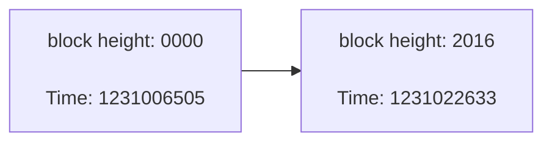

# Right Tech EP.7



## Mining & Block

### MINING การขุด

- **การขุด (Mining)** คือกระบวนการสร้าง "บล็อกใหม่" ที่รวมธุรกรรมในช่วงเวลานั้นและบันทึกลงใน **บล็อกเชน**
- ในยุคแรก:
  - โหนด (Node) ทุกโหนดมีสิทธิ์เข้าร่วมการขุดเพื่อแย่งสิทธิ์ในการสร้างบล็อกใหม่
  - เมื่อมีโหนดสร้างบล็อกใหม่สำเร็จ:
    - โหนดจะเพิ่มบล็อกนั้นลงในบล็อกเชนของตน
    - ส่งบล็อกนั้นให้โหนดอื่น ๆ ตรวจสอบ
  - หากโหนดอื่นเห็นว่าบล็อกถูกต้อง:
    - จะเพิ่มบล็อกนั้นลงในบล็อกเชนของตนเอง
    - ช่วยกระจายบล็อกนั้นออกไปยังโหนดอื่น ๆ ต่อไป

---

### How does mining work?

- การขุดเริ่มต้นด้วยการสร้าง **"candidate block"** หรือบล็อกที่ยังไม่สมบูรณ์

  - สร้าง **coinbase transaction** (ธุรกรรมแรกที่ให้รางวัลแก่ผู้ขุด)
  - เลือกธุรกรรมจาก **mempool** ของโหนดตนเองมาใส่ในบล็อก

- เมื่อนักขุดรวมธุรกรรมเรียบร้อยแล้ว จะทำการสร้าง **block header** โดยประกอบด้วย:

  - **Hash ของบล็อกก่อนหน้า**
  - **Merkle root** ของธุรกรรมในบล็อก

- **Block header** ยังประกอบด้วย:
  - `version` – เวอร์ชันของโปรโตคอล
  - `time` – เวลาที่ปิดบล็อกได้
  - `bits` – เป้าหมายของ hash (difficulty target)
  - `nonce` – ค่าที่เปลี่ยนไปเรื่อย ๆ เพื่อให้ได้ hash ที่ตรงตามเป้าหมาย

---

### NONCE

- **Nonce** เป็นฟิลด์ขนาด **4 ไบต์ (4 bytes)** ซึ่งเก็บค่าตัวเลขได้ตั้งแต่ `0` ถึง `4,294,967,295` (หรือ `0x0` ถึง `0xffffffff` ในเลขฐาน 16)
- ในกระบวนการขุดบล็อกของ Bitcoin:
  - นักขุดจะ **เปลี่ยนค่า nonce ไปเรื่อย ๆ** เพื่อหาค่า **hash ของ block header** ที่ต่ำกว่าค่า **target** ที่ระบบกำหนด
- การหาค่า nonce ที่ถูกต้องเป็น **การลองผิดลองถูก (brute force)** ไม่เกี่ยวกับทักษะใด ๆ
- การเปลี่ยนค่า nonce จะให้ผลลัพธ์ของ hash ที่แตกต่างกัน โดยไม่ต้องเปลี่ยนข้อมูลอื่นในบล็อก
  - แค่ปรับค่า nonce แล้วคำนวณ hash ใหม่เท่านั้น
- หากเราสุ่มค่า nonce จนครบแล้ว (4,294,967,296 ครั้ง) แต่ยังไม่เข้าเงื่อนไข target miner จะต้องเรียงธุรกรรมใหม่ (merkle root เปลี่ยน) และเริ่มสุ่ม nonce ใหม่

---

### Difficulty Adjustment

- **การปรับความยาก (Difficulty Adjustment)** เป็นกระบวนการที่ Bitcoin ใช้เพื่อรักษาเวลาในการสร้างบล็อกให้คงที่ที่ประมาณ **10 นาทีต่อบล็อก**
- โดยระบบจะปรับทุก ๆ **2016 บล็อก**

<div align="center">



</div>

#### ตัวอย่าง

- สมมุติว่า block แรก (height: 0)
  - ถูกสร้างขึ้นเมื่อ `1231006505` (Unix timestamp)
  - มี target เดิม (Current Target) คือ:

```
00000000FFFF0000000000000000000000000000000000000000000000000000
```

- Block ที่ 2016 ถูกสร้างเมื่อ `1231022633`

---

#### เวลาที่ใช้ในการขุดจริง (Actual Time)

$
\text{DifferentTime} = 1231022633 - 1231006505 = 16128\ \text{นาที}
$

---

#### อัตราส่วน (Ratio)

$
\text{ExpectedTime} = 2016 \times 10 = 20160\ \text{นาที} \\ \footnotesize { (คาดหวังว่าใช้เวลา \;10\; นาทีต่อบล็อก ดังนั้น \;2016\; บล็อกจะใช้เวลา \;20160\; นาที) }
$

$
\text{Ratio} = \dfrac{\text{ActualTime}}{\text{ExpectedTime}} = \dfrac{16128}{20160} = 0.8
$

---

#### เป้าหมายถัดไป (Next Target)

$
\text{NextTarget} = \text{CurrentTarget} \times \text{Ratio}
$

$
\qquad \qquad \quad \, \, = 00000000FFFF0000\ldots \times 0.8 \\
\qquad \qquad \quad \, \, = 00000000CCCC0000\ldots
$

> ค่าความยากจะ **ลดลง** เพราะเวลาขุดเร็วกว่าคาด

---

#### New Target แบบเต็ม (Full Precision)

```
00000000CCCC0000000000000000000000000000000000000000000000000000 (64 bits)
```

---

#### Target ใน Block Header (รูปแบบ bits field)

**Bitcoin จะบันทึก target ในรูปแบบ compact หรือ "bits field" 4 byte:**

$$ \text{07 CCCC00} $$

- **07** มาจาก Exponent (1 byte): แสดงจำนวน byte ที่ต้องขยับ coefficientไป (ขวาไปซ้าย)

  $
  \ldots CCCC0000000000000000000000000000000000000000000000000000 \quad \text{(56 bit)}\\ \\
  $

  $$
  \text{56 bits}  \rightarrow   \text{07 byte} \quad \therefore \;  \text{Exponent} = 07
  $$

- **CCCC00** มาจาก Coefficient (3 bytes):

  $$
  \ldots CCCC00 \ldots \quad \text{(6 bit)}\\ \\
  $$

> [!NOTE] > **07CCCC00** เป็นค่าประมาณของ target ถ้าหลัง `CCCCOO...` เป็น เลขอื่นๆที่ไม่ใช่ `0` จะถูกตัดออก เช่น `0CCCC0025FAB23...` จะถูกตัดเป็น `0CCCC00..00`

---

### Bitcoin มีไม่เกิน 21 ล้าน จริงมั้ย

Bitcoin ถูกออกแบบให้มีจำนวนจำกัดไม่เกิน 21,000,000 BTC โดยอาศัยหลักการที่เรียกว่า Halving ซึ่งจะลดจำนวนเหรียญที่ถูกปล่อยออกมาลงครึ่งหนึ่งทุก ๆ 210,000 บล็อก (ประมาณทุก 4 ปี)

หลักการนี้เปรียบเสมือนการ `right shift` ของจำนวนเหรียญในแต่ละรอบ เริ่มจาก 50 BTC ในบล็อกแรก และลดลงเรื่อย ๆ

#### ตารางแสดงการปล่อยเหรียญในแต่ละยุค (Epoch)

|                                       Binary (ฐานสอง)                                        | จำนวน (satoshis)           | Halving  | จำนวน BTC                         |
| :------------------------------------------------------------------------------------------: | :------------------------- | :------: | :-------------------------------- |
|          $\textcolor{green}{0001\ 0010\ 1010\ 0000\ 0101\ 1111\ 0010\ 0000\ 0000}$           | $5,\!000,\!000,\!000$      | $-50\%$  | $10.50\ \text{M-BTC}$             |
| $\textcolor{red}{0} \textcolor{green}{000\ 1001\ 0101\ 0000\ 0010\ 1111\ 1001\ 0000\ 0000 }$ | $2,\!500,\!000,\!000$      | $-50\%$  | $5.25\ \text{M-BTC}$              |
| $\textcolor{red}{00} \textcolor{green}{00\ 0100\ 1010\ 1000\ 0001\ 0111\ 1100\ 1000\ 0000}$  | $1,\!250,\!000,\!000$      | $-50\%$  | $2.625\ \text{M-BTC}$             |
| $\textcolor{red}{000} \textcolor{green}{0\ 0010\ 0101\ 0100\ 0000\ 1011\ 1110\ 0100\ 0000}$  | $625,\!000,\!000$          | $-50\%$  | $1.3125\ \text{M-BTC}$            |
|  $\textcolor{red}{0000}\ \textcolor{green}{0001\ 0010\ 1010\ 0000\ 0101\ 1111\ 0010\ 0000}$  | $312,\!500,\!000$          | $-50\%$  | $656,\!250\ \text{BTC (ปี 2024)}$ |
|  $\textcolor{red}{0000\ 0}\textcolor{green}{000\ 1001\ 0101\ 0000\ 0010\ 1111\ 1001\ 0000}$  | $156,\!250,\!000$          | $-50\%$  | $328,\!125\ \text{BTC}$           |
|  $\textcolor{red}{0000\ 00}\textcolor{green}{00\ 0100\ 1010\ 1000\ 0001\ 0111\ 1100\ 1000}$  | $78,\!125,\!000$           | $-50\%$  | $\qquad \qquad \quad \vdots$                          |
|  $\textcolor{red}{0000\ 000}\textcolor{green}{0\ 0010\ 0101\ 0100\ 0000\ 1011\ 1110\ 0100}$  | $39,\!062,\!500$           | $-50\%$  | $\qquad \qquad \quad \vdots$                          |
|  $\textcolor{red}{0000\ 0000}\ \textcolor{green}{0001\ 0010\ 1010\ 0000\ 0101\ 1111\ 0010}$  | $19,\!531,\!250$           | $-50\%$  | $\qquad \qquad \quad \vdots$                          |
|  $\textcolor{red}{0000\ 0000\ 0}\textcolor{green}{000\ 1001\ 0101\ 0000\ 0010\ 1111\ 1001}$  | $9,\!765,\!625$            | $-50\%$  | $\qquad \qquad \quad \vdots$                          |
|                                           $\vdots$                                           | $\quad \quad \quad \vdots$ | $\vdots$ | $\qquad \qquad \quad \vdots$                          |
|  $\textcolor{red}{0000\ 0000\ 0000\ 0000\ 0000\ 0000\ 0000\ 0000\ 000}\textcolor{green}{1}$  | $1$ satoshi                | $-50\%$  | $\qquad \qquad \quad \vdots$                          |
|           $\textcolor{red}{0000\ 0000\ 0000\ 0000\ 0000\ 0000\ 0000\ 0000\ 0000}$            | $1$ satoshi                | $-100\%$ | $\qquad \qquad \quad 0$                               |

### 51 % Attackkkk !!!!

#### What is a 51% Attack?

ในระบบของ Bitcoin เราจะยึด **Chain ที่ยาวที่สุด** เป็นความจริงหนึ่งเดียวเสมอ  
ซึ่งเป็นหลักการพื้นฐานของระบบ

สมมุติว่า **Bob** จ่ายเงิน **1 BTC** เพื่อซื้อรถจาก **Alice** และธุรกรรมนี้ถูกรวมอยู่ใน **Block 1000**  
แต่ในขณะเดียวกัน Bob ได้เตรียม **Block template** อีกชุดที่ **ไม่มีธุรกรรมที่จ่ายเงินให้ Alice**

จากนั้น Bob พยายามขุด **Block 1000 (ฉบับปลอม)** ด้วยตัวเองในขณะที่เครือข่ายทั่วไปกำลังขุด **Block 1001**

หาก Bob สามารถขุดต่อเนื่องไปจน **chain ของเขายาวกว่า chain ปกติ** ได้สำเร็จ  
ระบบ Bitcoin จะถือว่า chain ของ Bob เป็น “ความจริง”  
และธุรกรรมที่ Bob จ่ายให้ Alice จะหายไปจาก chain — ทำให้ Alice ไม่ได้รับเงินนั้นเลย

---

#### สิ่งที่ 51% Attack ทำได้

นี่คือสิ่งที่เรียกว่า **51% Attack** — ถ้าใครมีพลังขุดเกินครึ่งหนึ่งของเครือข่ายทั้งหมด  
เขาสามารถ:

- ปฏิเสธไม่ยอมใส่ธุรกรรมบางรายการ (เช่น ป้องกันคนอื่นโอนเหรียญได้)
- **ย้อนธุรกรรมของตัวเองคืน** (double-spend)

> แต่นี่คือสิ่งเดียวที่ 51% Attack ทำได้ — **ไม่สามารถขโมยเหรียญคนอื่น หรือเปลี่ยนกฎของ Bitcoin ได้**

---

#### ต้นทุนในการทำ 51% Attack

- ปัจจุบันกำลังการขุดของ Bitcoin อยู่ที่ประมาณ **870 – 940 EH/s** (Exahash ต่อวินาที)
- เครือข่ายการขุด Bitcoin ทั้งโลกใช้พลังงานไฟฟ้าในระดับใกล้เคียงกับ **ประเทศขนาดกลางหนึ่งประเทศ**

---

หากใครต้องการทำ **51% Attack** จะต้อง:

- มีพลังงานไฟฟ้าในระดับเดียวกับที่เครือข่าย Bitcoin ใช้อยู่ทั้งโลก
- มีเครื่องขุดในปริมาณเทียบเท่ากับที่ใช้งานอยู่ทั้งเครือข่าย
- มีพื้นที่และระบบสำหรับติดตั้งและควบคุมเครื่องขุดจำนวนมหาศาล

---

สิ่งที่ผู้โจมตีสามารถทำได้จาก 51% Attack คือ:

- **ย้อนธุรกรรมของตัวเองคืน (Double-spend)**
  > แต่ **ไม่สามารถขโมยเหรียญของคนอื่น** ได้
- **เซ็นเซอร์ธุรกรรมบางรายการ** ไม่ให้เกิดขึ้นในเครือข่าย

---

แล้วมันคุ้มค่าหรือไม่?

- ถ้าต้องลงทุนระดับนี้ เพียงเพื่อจะย้อนธุรกรรมของตัวเอง มันอาจ **ไม่คุ้มค่า** เลย
- หากมีคนที่มีทรัพยากรมากขนาดนี้จริง ๆ  
  ทำไมเขาไม่เลือกที่จะ **ร่วมขุด Bitcoin อย่างถูกต้อง** แทน?
  - จะได้ทั้งรางวัลเป็น Bitcoin
  - และช่วยเสริมความมั่นคงให้ระบบมากขึ้นจากการเข้าร่วม

#### สรุป

> การทำ 51% Attack ในยุคปัจจุบัน **มีต้นทุนสูงมาก ไม่คุ้มค่า และแทบเป็นไปไม่ได้** ทั้งในด้านเทคนิค พลังงาน และผลตอบแทน

---
